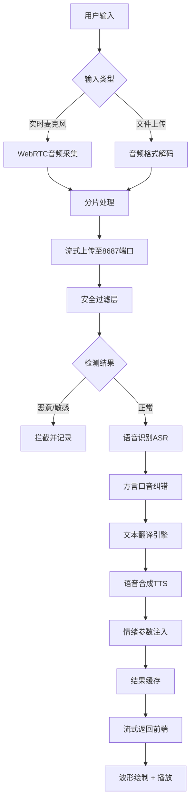

## 1. 产品概述

综合语音翻译工具是一款集语音识别、文本翻译、语音合成为一体的网页端应用，支持实时麦克风收音和本地音频上传双模式，提供普通话、多方言、多国语言的双向互译服务。通过情绪合成技术，可生成带有喜悦、愤怒、悲伤、平淡等多种情感色彩的语音输出，同时具备长音频分布式处理、安全过滤等企业级特性。

### 核心价值
- 解决跨语言沟通障碍，支持方言与多国语互译
- 提供专业级语音合成，支持情绪、语速、音色自定义
- 长音频分片处理，支持断点续传和任务优先级调度
- 全链路安全防护，包括内容过滤、恶意拦截、接口限流

## 2. 核心功能

### 2.1 用户角色

| 角色 | 注册方式 | 核心权限 |
|------|----------|----------|
| 普通用户 | 无需注册，直接使用 | 使用实时翻译、音频上传翻译、查看任务历史 |
| 高级用户 | 手机号注册 | 长音频优先处理、自定义音色保存、更多情绪选项 |
| 管理员 | 后台账号 | 系统配置、任务监控、内容审核、限流规则管理 |

### 2.2 功能模块

1. **翻译工作台**：实时麦克风翻译、音频文件上传、动态波形显示、翻译结果展示
2. **参数控制面板**：源语言/目标语言选择、方言选项、情绪选择、语速/音量/音色调节
3. **任务管理中心**：任务列表、进度查看、优先级设置、断点续处理、历史记录
4. **系统设置**：音频格式偏好、缓存管理、断网重连配置、快捷键设置

### 2.3 页面详情

| 页面名称 | 模块名称 | 功能描述 |
|---------|----------|----------|
| 翻译工作台 | 录音控制区 | 开始/暂停/停止录音，实时波形可视化，录音时长统计 |
| 翻译工作台 | 音频上传区 | 拖拽上传、文件选择、多格式支持（MP3/WAV/FLAC/AAC/M4A） |
| 翻译工作台 | 语言选择区 | 源语言自动检测，支持100+语种，20+方言选项 |
| 翻译工作台 | 合成参数区 | 情绪选择（喜悦/愤怒/悲伤/平淡）、语速调节（0.5x-2.0x）、音量调节（0-100）、音色选择（10+预设） |
| 翻译工作台 | 结果展示区 | 原文与译文对照显示，时间戳对齐，播放控制，文本复制导出 |
| 任务管理中心 | 任务列表 | 显示当前/历史任务，状态（排队/处理中/完成/失败），进度条 |
| 任务管理中心 | 任务操作 | 优先级调整、暂停/恢复、取消、重试、结果下载 |
| 系统设置页 | 音频配置 | 采样率设置、缓冲区大小、自动分片阈值、格式偏好 |
| 系统设置页 | 网络配置 | 断网自动重连、重试次数、超时设置 |

## 3. 核心流程

### 实时翻译流程
用户点击开始录音 → 浏览器获取麦克风权限 → Web Audio API采集音频 → 绘制实时波形 → 流式分片上传至后端 → 语音识别（ASR）→ 口音自适应纠错 → 文本翻译 → 语音合成（TTS）→ 情绪参数注入 → 流式返回音频 → 前端播放并展示文本

### 长音频处理流程
用户上传音频文件 → 格式校验与转换 → 分片切割（默认30秒/片）→ 创建异步任务 → 加入分布式队列 → 按优先级调度 → 分片并行处理 → 结果时序对齐 → 合并输出 → 通知用户完成

### 异常处理流程
网络中断 → 本地缓存未发送数据 → 自动重连 → 断点续传 → 恢复处理
任务失败 → 记录失败原因 → 自动重试（最多3次，指数退避） → 超过阈值标记为失败 → 用户手动重试

## 4. 用户界面设计

### 4.1 设计风格
- **主色调**：深海蓝（#0F172A）作为主背景，科技感青蓝（#0EA5E9）作为主色，霓虹紫（#8B5CF6）作为强调色
- **辅助色**：成功绿（#10B981）、警告橙（#F59E0B）、错误红（#EF4444）
- **字体**：标题使用 Space Grotesk，正文使用 Inter Mono，数字使用 JetBrains Mono
- **按钮风格**：玻璃拟态（Glassmorphism），圆角12px，悬浮时微微上浮，发光效果
- **布局风格**：三栏式布局，左侧控制面板，中间主工作区，右侧任务面板
- **视觉效果**：动态波形使用 Canvas 绘制，配合渐变和发光效果；背景使用网格纹理 + 渐变光晕

### 4.2 页面设计概述

| 页面名称 | 模块名称 | UI元素 |
|---------|----------|--------|
| 翻译工作台 | 录音控制区 | 大型圆形录音按钮，脉冲动画，录音时外圈光环呼吸效果 |
| 翻译工作台 | 波形显示区 | Canvas动态波形，频谱柱状图，实时音量指示，渐变色填充 |
| 翻译工作台 | 语言选择区 | 下拉选择器，自动检测徽章，交换语言按钮（带旋转动画） |
| 翻译工作台 | 合成参数区 | 滑块控件，情绪图标按钮（表情符号+文字），实时预览按钮 |
| 翻译工作台 | 结果展示区 | 卡片式对照布局，时间轴标记，播放进度条，复制/下载按钮 |
| 任务管理中心 | 任务列表 | 卡片列表，进度条动画，状态徽章，悬停显示操作按钮 |
| 系统设置页 | 设置表单 | 分组卡片，开关控件，数字输入框，保存按钮带成功反馈 |

### 4.3 响应式设计
- **桌面端**（>1200px）：三栏完整布局，所有功能可见
- **平板端**（768px-1200px）：左右面板可折叠，中间工作区自适应
- **移动端**（<768px）：单栏布局，底部Tab切换，核心功能优先展示
- **触控优化**：按钮最小尺寸48x48px，滑块加大触控区域，关键操作提供触觉反馈

### 4.4 动效设计
- **页面加载**：元素错位淡入，从下往上滑入，延迟100ms递增
- **录音状态**：按钮外圈光环呼吸，波形从中间向两边扩散
- **翻译进行**：结果区域骨架屏脉冲动画，进度条平滑流动
- **交互反馈**：按钮点击缩放95%，切换选项卡滑动过渡，滑块拖动实时预览
