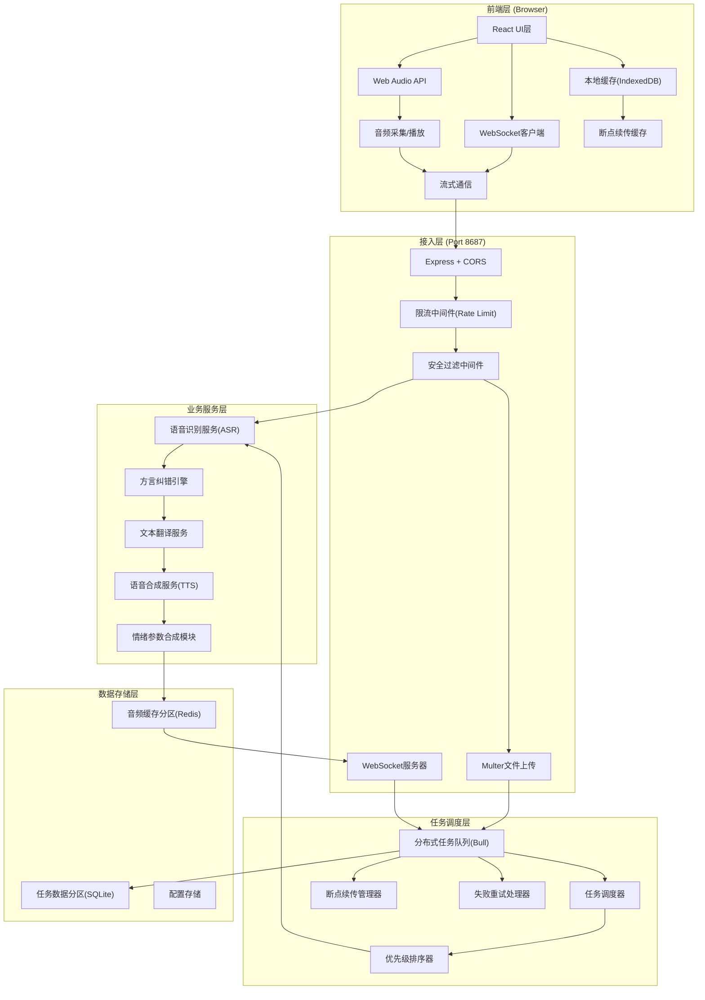
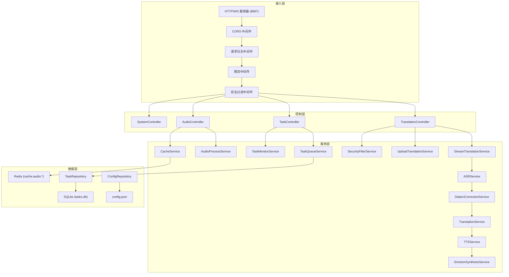
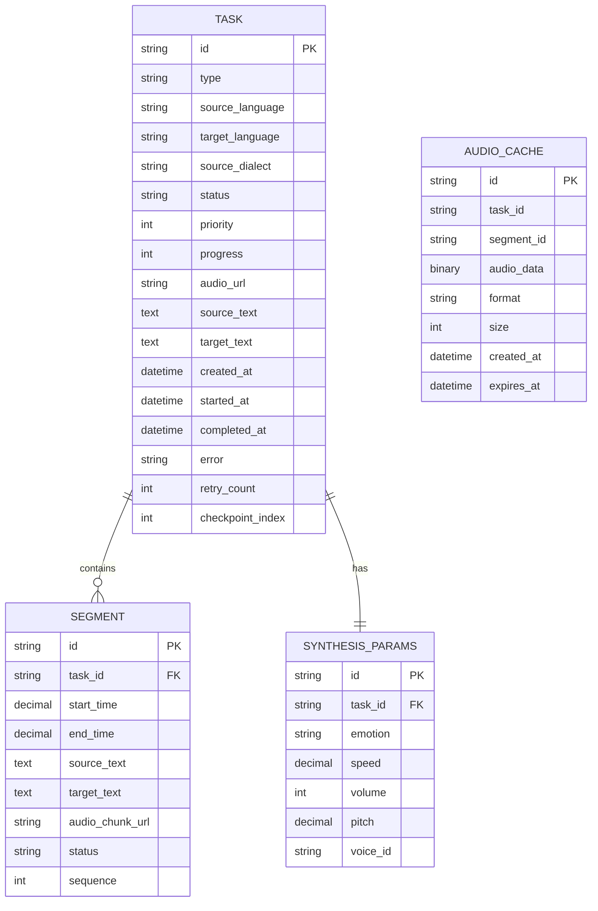

## 1. 架构设计



## 2. 技术描述

### 前端技术栈
- **框架**: React 18 + TypeScript 5
- **构建工具**: Vite 5
- **样式方案**: Tailwind CSS 3
- **状态管理**: Zustand 4
- **路由**: React Router DOM 6
- **图标**: Lucide React
- **音频处理**: Web Audio API + MediaRecorder API
- **流式通信**: WebSocket + Socket.io Client
- **本地存储**: IndexedDB (dexie.js)
- **可视化**: Canvas 2D API

### 后端技术栈
- **框架**: Express 4 + TypeScript
- **WebSocket**: Socket.io 4
- **任务队列**: Bull (Redis)
- **音频处理**: fluent-ffmpeg
- **语音识别**: 集成模式 (可对接 Whisper / 百度 / 阿里云)
- **文本翻译**: 集成模式 (可对接 Google / 百度 / 有道)
- **语音合成**: 集成模式 (可对接 Azure TTS / 百度 TTS)
- **限流**: express-rate-limit
- **安全**: express-mongo-sanitize + xss-clean
- **日志**: Winston
- **服务端口**: 8687

### 数据存储
- **音频缓存**: Redis 7 (独立分区: cache:audio:*)
- **任务数据**: SQLite 3 (独立分区: data/tasks.db)
- **配置数据**: JSON 文件 + 环境变量

## 3. 路由定义

| 路由 | 方法 | 用途 |
|------|------|------|
| `/` | GET | 翻译工作台首页 |
| `/tasks` | GET | 任务管理中心 |
| `/settings` | GET | 系统设置页 |
| `/api/v1/health` | GET | 健康检查 |
| `/api/v1/languages` | GET | 获取支持的语言列表 |
| `/api/v1/voices` | GET | 获取可用音色列表 |
| `/api/v1/translate/stream` | WS | 实时流式翻译 |
| `/api/v1/translate/upload` | POST | 上传音频文件翻译 |
| `/api/v1/tasks` | GET | 获取任务列表 |
| `/api/v1/tasks/:id` | GET | 获取任务详情 |
| `/api/v1/tasks/:id` | DELETE | 取消任务 |
| `/api/v1/tasks/:id/retry` | POST | 重试失败任务 |
| `/api/v1/tasks/:id/priority` | PUT | 调整任务优先级 |
| `/api/v1/audio/:id` | GET | 下载合成音频 |
| `/api/v1/cache/:id` | DELETE | 清除音频缓存 |

## 4. API 定义

### 类型定义

```typescript
// 语言类型
interface Language {
  code: string;
  name: string;
  dialect?: string;
  type: 'standard' | 'dialect';
}

// 音色类型
interface Voice {
  id: string;
  name: string;
  gender: 'male' | 'female' | 'neutral';
  language: string;
  emotionSupport: EmotionType[];
}

// 情绪类型
type EmotionType = 'joy' | 'anger' | 'sadness' | 'neutral';

// 合成参数
interface SynthesisParams {
  emotion: EmotionType;
  speed: number; // 0.5 - 2.0
  volume: number; // 0 - 100
  pitch: number; // 0.5 - 2.0
  voiceId: string;
}

// 任务状态
type TaskStatus = 'queued' | 'processing' | 'completed' | 'failed' | 'cancelled';

// 任务类型
interface TranslationTask {
  id: string;
  type: 'realtime' | 'upload';
  sourceLanguage: string;
  targetLanguage: string;
  sourceDialect?: string;
  status: TaskStatus;
  priority: number; // 1-10, 10最高
  progress: number; // 0-100
  params: SynthesisParams;
  audioUrl?: string;
  sourceText?: string;
  targetText?: string;
  segments: TranslationSegment[];
  createdAt: number;
  startedAt?: number;
  completedAt?: number;
  error?: string;
  retryCount: number;
}

// 翻译片段
interface TranslationSegment {
  id: string;
  startTime: number;
  endTime: number;
  sourceText: string;
  targetText: string;
  audioChunk?: string;
  status: 'pending' | 'processing' | 'completed' | 'failed';
}

// WebSocket消息
interface WSMessage {
  type: 'audio_chunk' | 'text_result' | 'status' | 'error' | 'complete';
  data: any;
  taskId?: string;
  timestamp: number;
}

// 限流配置
interface RateLimitConfig {
  windowMs: number;
  max: number;
  keyGenerator: (req: Request) => string;
}

// 安全过滤结果
interface FilterResult {
  passed: boolean;
  level: 'safe' | 'warning' | 'dangerous';
  reason?: string;
  blocked: boolean;
}
```

### 请求/响应示例

#### 上传翻译请求
```http
POST /api/v1/translate/upload
Content-Type: multipart/form-data

file: [audio file]
sourceLanguage: zh-CN
targetLanguage: en-US
params: {"emotion":"neutral","speed":1.0,"volume":80,"voiceId":"zh-female-1"}
```

#### 任务响应
```json
{
  "code": 0,
  "message": "success",
  "data": {
    "taskId": "task_abc123",
    "status": "queued",
    "priority": 5,
    "estimatedTime": 120
  }
}
```

#### WebSocket 流式消息
```json
// 发送音频块
{
  "type": "audio_chunk",
  "data": "base64_encoded_audio",
  "taskId": "task_abc123",
  "sequence": 1,
  "timestamp": 1718200000000
}

// 接收翻译结果
{
  "type": "text_result",
  "data": {
    "source": "你好世界",
    "target": "Hello World",
    "startTime": 0,
    "endTime": 2.5,
    "audio": "base64_audio_chunk"
  },
  "taskId": "task_abc123",
  "timestamp": 1718200000500
}
```

## 5. 服务器架构图



## 6. 数据模型

### 6.1 数据模型定义



### 6.2 数据定义语言

```sql
-- 任务表
CREATE TABLE IF NOT EXISTS tasks (
  id TEXT PRIMARY KEY,
  type TEXT NOT NULL CHECK (type IN ('realtime', 'upload')),
  source_language TEXT NOT NULL,
  target_language TEXT NOT NULL,
  source_dialect TEXT,
  status TEXT NOT NULL DEFAULT 'queued' CHECK (status IN ('queued', 'processing', 'completed', 'failed', 'cancelled')),
  priority INTEGER NOT NULL DEFAULT 5 CHECK (priority BETWEEN 1 AND 10),
  progress INTEGER NOT NULL DEFAULT 0 CHECK (progress BETWEEN 0 AND 100),
  audio_url TEXT,
  source_text TEXT,
  target_text TEXT,
  created_at INTEGER NOT NULL,
  started_at INTEGER,
  completed_at INTEGER,
  error TEXT,
  retry_count INTEGER NOT NULL DEFAULT 0,
  checkpoint_index INTEGER DEFAULT 0,
  INDEX idx_status (status),
  INDEX idx_priority (priority),
  INDEX idx_created_at (created_at)
);

-- 翻译片段表
CREATE TABLE IF NOT EXISTS segments (
  id TEXT PRIMARY KEY,
  task_id TEXT NOT NULL REFERENCES tasks(id) ON DELETE CASCADE,
  start_time REAL NOT NULL,
  end_time REAL NOT NULL,
  source_text TEXT,
  target_text TEXT,
  audio_chunk_url TEXT,
  status TEXT NOT NULL DEFAULT 'pending' CHECK (status IN ('pending', 'processing', 'completed', 'failed')),
  sequence INTEGER NOT NULL,
  INDEX idx_task_id (task_id),
  INDEX idx_sequence (sequence)
);

-- 合成参数表
CREATE TABLE IF NOT EXISTS synthesis_params (
  id TEXT PRIMARY KEY,
  task_id TEXT NOT NULL UNIQUE REFERENCES tasks(id) ON DELETE CASCADE,
  emotion TEXT NOT NULL DEFAULT 'neutral' CHECK (emotion IN ('joy', 'anger', 'sadness', 'neutral')),
  speed REAL NOT NULL DEFAULT 1.0 CHECK (speed BETWEEN 0.5 AND 2.0),
  volume INTEGER NOT NULL DEFAULT 80 CHECK (volume BETWEEN 0 AND 100),
  pitch REAL NOT NULL DEFAULT 1.0 CHECK (pitch BETWEEN 0.5 AND 2.0),
  voice_id TEXT NOT NULL
);

-- 安全过滤日志表
CREATE TABLE IF NOT EXISTS filter_logs (
  id TEXT PRIMARY KEY,
  task_id TEXT,
  filter_type TEXT NOT NULL,
  level TEXT NOT NULL CHECK (level IN ('safe', 'warning', 'dangerous')),
  reason TEXT,
  blocked INTEGER NOT NULL DEFAULT 0,
  created_at INTEGER NOT NULL,
  client_ip TEXT,
  user_agent TEXT
);

-- 限流日志表
CREATE TABLE IF NOT EXISTS rate_limit_logs (
  id TEXT PRIMARY KEY,
  client_key TEXT NOT NULL,
  endpoint TEXT NOT NULL,
  request_count INTEGER NOT NULL,
  blocked INTEGER NOT NULL DEFAULT 0,
  window_start INTEGER NOT NULL,
  created_at INTEGER NOT NULL,
  INDEX idx_client_key (client_key),
  INDEX idx_created_at (created_at)
);

-- Redis 键设计
-- 音频缓存: cache:audio:{taskId}:{segmentId}
-- 任务状态: task:status:{taskId}
-- 队列锁: queue:lock:{queueName}
-- 限流计数: rate:{clientKey}:{endpoint}
```
